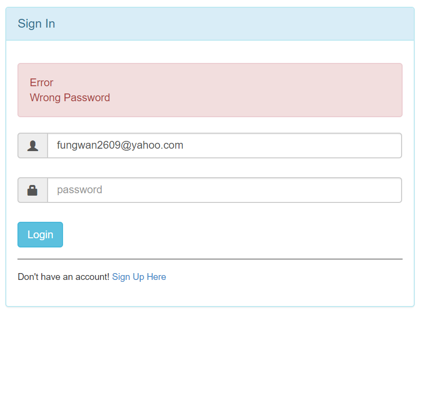

# login/out page
In this project, I'm using HTML, CSS, Javasrcit, mySQL for database and NodeJS to make SignIn and SignOut Application.
  "dependencies": {
    "body-parser": "^1.18.3",
    "config": "^3.0.1",
    "ejs": "^2.6.1",
    "express": "^4.16.4",
    "express-session": "^1.15.6",
    "mysql": "^2.16.0",
    "q": "^1.5.1" }

